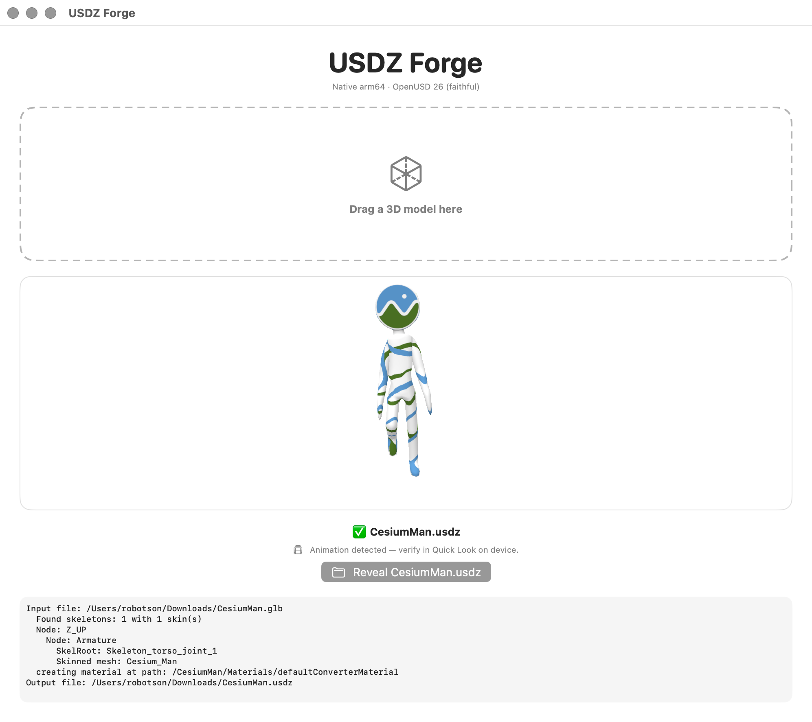

# USDZ Forge

A small, native macOS app that converts **GLB / glTF / OBJ → animated USDZ** by drag-and-drop,
with a live 3D preview. It's a modern, self-contained successor to Apple's discontinued
**Reality Converter**.



## Why

Apple's Reality Converter was removed after WWDC 25 and no longer runs on current macOS —
its conversion helper hard-links **system Python 2.7**, which Apple removed in macOS 12.3.
The underlying engine (Apple's `usdzconvert`), however, is solid and MIT-licensed.

USDZ Forge takes that exact engine, ports it to **Python 3 + modern OpenUSD (26.x)**, and wraps it
in a native SwiftUI app. The Python interpreter, OpenUSD, and the converter are all **bundled inside
the app** — nothing needs to be installed on the target machine.

## Features

- Drag-and-drop GLB / glTF / OBJ → USDZ
- **Animation preserved** — node transforms, skeletal/skinned (UsdSkel), morph targets
- PBR materials + textures embedded into the package
- Live in-window 3D preview with animation playback (SceneKit)
- Flags in the UI whether the output actually carries animation
- Fully self-contained, **Apple-Silicon native (no Rosetta)**

## Requirements

- macOS 13 (Ventura) or later
- Apple Silicon (M1 or newer)

## Install (prebuilt)

Download the latest `USDZ-Forge.zip` from Releases, unzip, and move `USDZ Forge.app` to
`/Applications`. Because the app is ad-hoc signed, the first launch needs **right-click → Open**
(a one-time Gatekeeper step for un-notarized apps).

## Build from source

Prerequisites: Xcode 15+ (Swift 5.9+), `curl`, and an internet connection for the one-time
engine bootstrap.

```bash
# 1. Bootstrap the bundled engine: downloads a relocatable CPython + installs OpenUSD (usd-core)
./engine/setup-engine.sh

# 2. Build the Swift app
swift build -c release

# 3. Assemble + sign the self-contained .app and emit dist/USDZ-Forge.zip
./packaging/build-app.sh
```

The app resolves its engine from `Contents/Resources/engine` when bundled. For `swift run`
during development, point it at the source engine with:

```bash
USDZFORGE_ENGINE_ROOT="$PWD/engine" swift run
```

## Notes & limitations

- **USDZ / AR Quick Look plays a single animation timeline.** Source files with multiple
  animation clips will keep only one; morph-only animation may not survive. This is a USDZ
  format constraint, not a tool bug.
- Ad-hoc signed builds show a Gatekeeper prompt on first open. For frictionless distribution,
  re-sign with an Apple **Developer ID** identity and notarize (`notarytool` + `stapler`).

## Credits & license

- App code: MIT (see [LICENSE](LICENSE)).
- Conversion engine: Apple's `usdzconvert` (© Apple Inc., MIT) — ported to Python 3 / modern
  OpenUSD. Apple's original notice is retained in `engine/native/LICENSE.txt`.
- [OpenUSD](https://openusd.org) via the `usd-core` wheel.
- Relocatable interpreter via [python-build-standalone](https://github.com/astral-sh/python-build-standalone).
